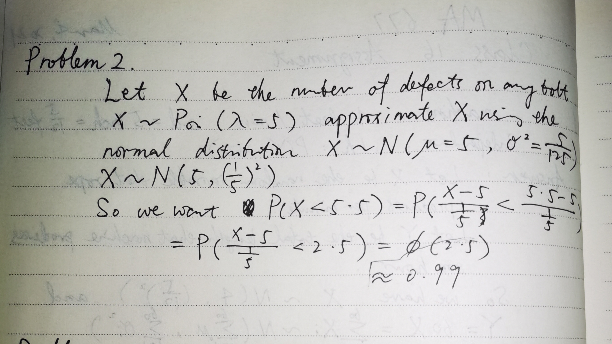

```{r setup, include=FALSE}
knitr::opts_chunk$set(echo = TRUE)
pacman::p_load("animation")
```

## Problem 1 


## Problem 2


## Problem 3-4


## Problem 5
I choose skewed Beta distribution Beta(alpha=3,beta=2) from which to sample. The mean of the skewed Beta distribution is E(X)=3/5 and the variance is Var(X)=1/25
```{r,warning=FALSE}
#skewed Beta distribution
hist(rbeta(100,3,2))

#Mean & Variance of Beta distribution
a=3
b=2
E=a/(a+b)
Var=(a*b)/((a+b)^2*(a+b+1))

#Make 10,1000 draws with 10,000 samples from Beta(3,2) each draw
sample=c() 
k=10000 
for(i in 1:10000){
  data2=rbeta(k,3,2) 
  sample[i]=(sum(data2)-k*E)/(sqrt(k*Var)) 
}

#Mean & Variance of samples
mean(sample)
sd(sample) 

#Graphically display of the sample distribution 
hist(sample)
#Cut the sample into intervals and plot the probability histogram
s=seq(min(sample),max(sample),0.5) 
A=table(cut(sample,br=s))
plot(A/sum(A)) 

#Use Pearson Chi test to validate whether the sample is standard Normal distributed.
q=pnorm(s,0,1);
n=length(q)
p=numeric(n-1)
p[1]=q[2]
p[n-1]=1-q[n-1]
for(i in 2:(n-2)){
  p[i]=q[i+1]-q[i]
}
chisq.test(A,p) 
#p value is larger than 0.05，we cannot reject the null hypothesis that the sample is a standard Normal distribution.
```


